# 📋 DEFINICIÓN COMPLETA DE MÓDULOS - OnBoard HHRR

## ARQUITECTURA GENERAL DEL SISTEMA

El sistema OnBoard HHRR está estructurado en **6 módulos principales** con **flujos de procesos interconectados** que garantizan la integridad y trazabilidad de todas las operaciones de Recursos Humanos.

---

## 🔐 MÓDULO 1: AUTENTICACIÓN Y GESTIÓN DE ROLES

### Propósito
Controlar el acceso al sistema mediante autenticación segura y un sistema de roles jerárquicos con permisos granulares adaptado a la estructura organizacional venezolana.

### Componentes Principales
1. **Sistema de Login/Logout**
2. **Gestión de Sesiones** 
3. **Administración de Roles**
4. **Permisos Granulares**
5. **Auditoría de Accesos**

### Flujo de Procesos

#### 🔄 FLUJO 1.1: AUTENTICACIÓN DE USUARIO
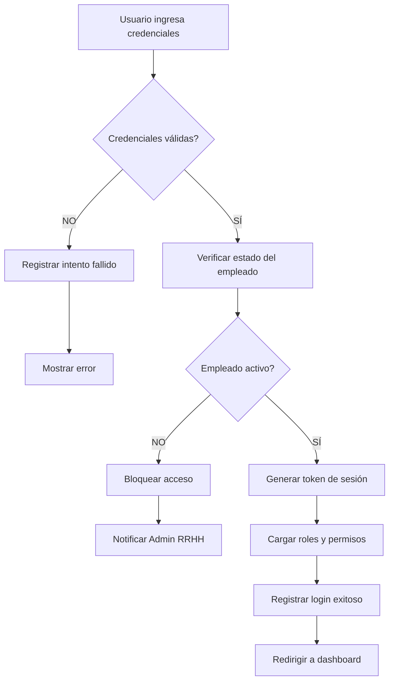

#### 🔄 FLUJO 1.2: ASIGNACIÓN DE ROLES
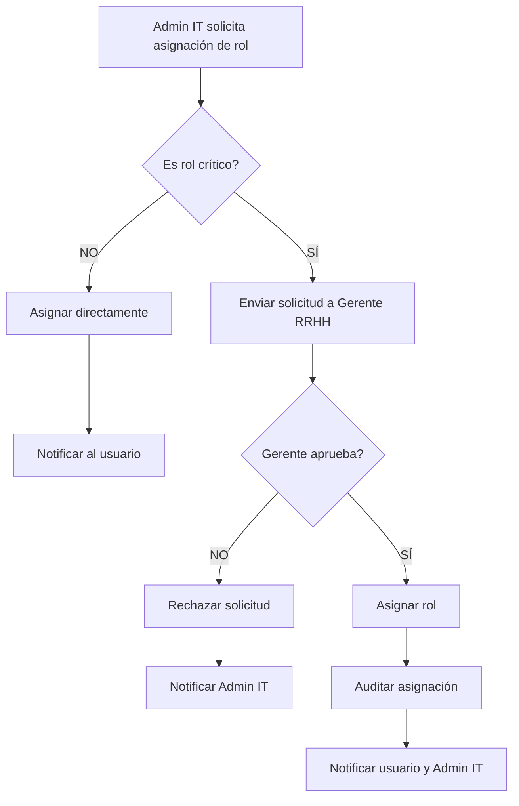

### Roles y Permisos Definidos

| Nivel | Rol | Permisos Principales |
|-------|-----|---------------------|
| **1** | **Gerente RRHH** | Acceso total, aprobación de roles críticos, informes ejecutivos |
| **2** | **Admin RRHH** | Gestión empleados, contratos, períodos prueba, reclutamiento |
| **3** | **Admin IT** | Asignación roles, tablas maestras, configuración sistema |
| **4** | **Supervisor** | Gestión equipo directo, egresos, feedback períodos prueba |
| **5** | **Empleado Captación** | Carga candidatos, gestión reclutamiento inicial |
| **6** | **Empleado RRHH** | Permisos específicos según función asignada |

### Estados de Sesión
- **Activa**: Usuario logueado con token válido
- **Expirada**: Token vencido, requiere re-autenticación
- **Revocada**: Sesión terminada por administrador
- **Bloqueada**: Usuario temporalmente bloqueado

---

## 👥 MÓDULO 2: GESTIÓN DE EMPLEADOS Y EXPEDIENTES

### Propósito
Administrar el ciclo de vida completo de los empleados desde el reclutamiento hasta el egreso, manteniendo expedientes digitales actualizados y trazables.

### Componentes Principales
1. **Gestión de Candidatos (Reclutamiento)**
2. **Registro de Nuevos Empleados**
3. **Expedientes Digitales**
4. **Gestión de Jerarquías**
5. **Actualización de Datos**

### Flujo de Procesos

#### 🔄 FLUJO 2.1: PROCESO DE RECLUTAMIENTO
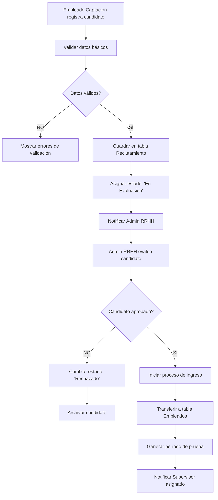

#### 🔄 FLUJO 2.2: GESTIÓN DE EXPEDIENTES
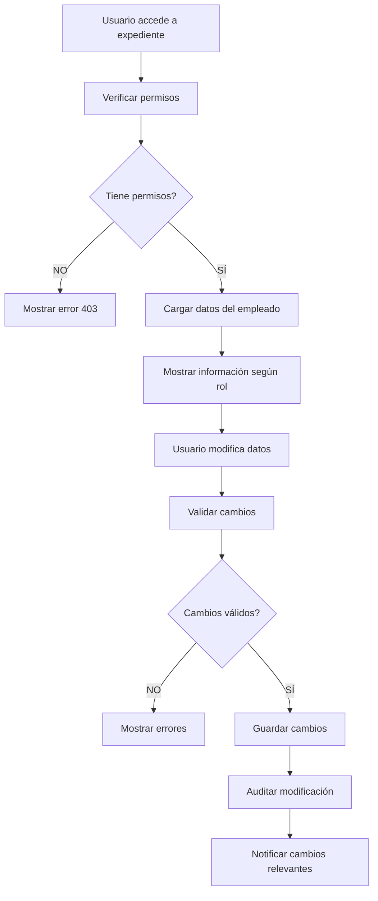

### Estados de Empleado
- **Activo**: Empleado trabajando normalmente
- **En Período de Prueba**: Nuevo ingreso o movimiento interno
- **Licencia**: Ausencia temporal autorizada
- **Suspendido**: Suspensión temporal por proceso disciplinario
- **Inactivo**: Empleado egresado del sistema

---

## 📄 MÓDULO 3: GESTIÓN DE CONTRATOS Y MOVIMIENTOS

### Propósito
Administrar todos los tipos de contratos laborales y movimientos internos (ascensos, traslados, renovaciones) con validaciones automáticas y flujos de aprobación.

### Componentes Principales
1. **Tipos de Contrato**
2. **Movimientos Internos**
3. **Renovaciones Automáticas**
4. **Validación de Fechas**
5. **Workflow de Aprobaciones**

### Flujo de Procesos

#### 🔄 FLUJO 3.1: CREACIÓN DE CONTRATO
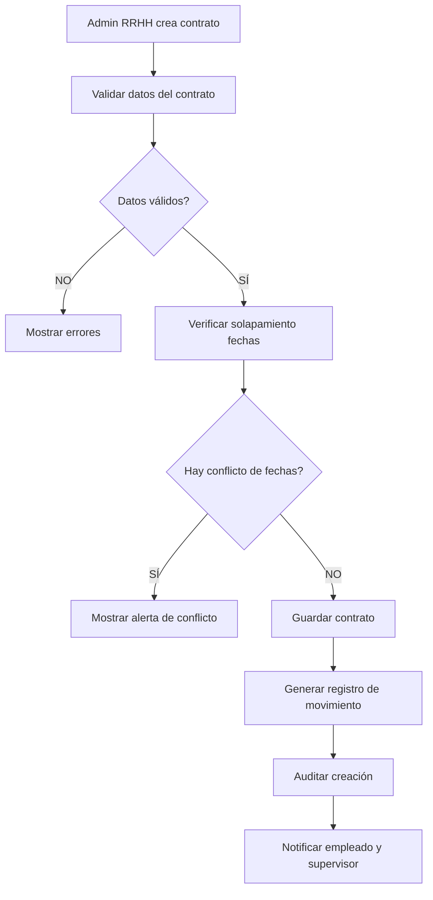

#### 🔄 FLUJO 3.2: MOVIMIENTO INTERNO (ASCENSO/TRASLADO)
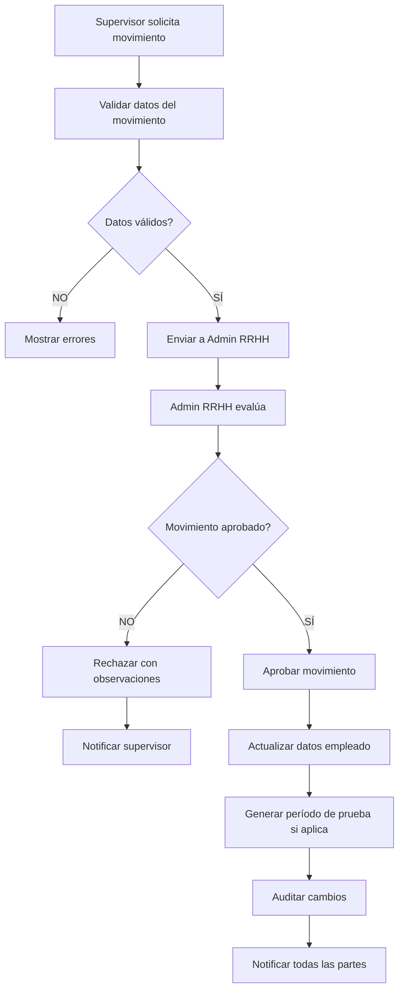

#### 🔄 FLUJO 3.3: RENOVACIÓN DE CONTRATO
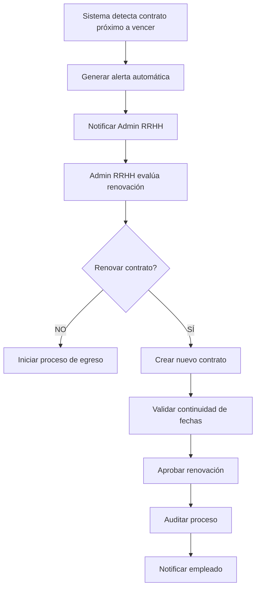

### Tipos de Movimiento
- **Ingreso**: Nuevo empleado al sistema
- **Ascenso**: Promoción a cargo superior
- **Traslado**: Cambio de departamento/gerencia
- **Renovación**: Extensión de contrato existente
- **Cambio Contractual**: Modificación de términos
- **Egreso**: Salida del empleado

---

## ⏱️ MÓDULO 4: GESTIÓN DE PERÍODOS DE PRUEBA

### Propósito
Administrar de manera unificada los períodos de prueba tanto para nuevos ingresos como para movimientos internos, con sistema de alertas y feedback automático.

### Componentes Principales
1. **Registro de Períodos de Prueba**
2. **Sistema de Alertas Automáticas**
3. **Gestión de Feedback**
4. **Evaluación y Confirmación**
5. **Reportes de Seguimiento**

### Flujo de Procesos

#### 🔄 FLUJO 4.1: INICIO DE PERÍODO DE PRUEBA
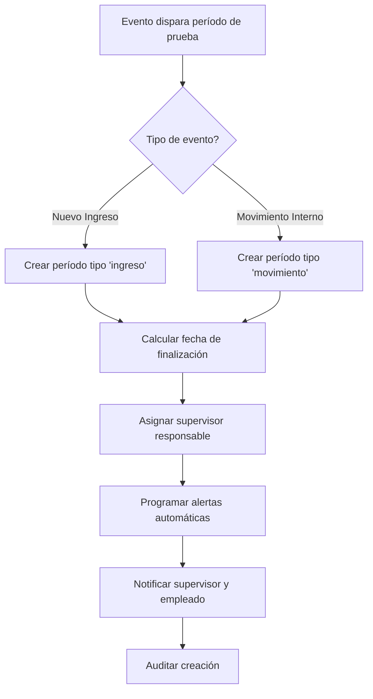

#### 🔄 FLUJO 4.2: SISTEMA DE ALERTAS
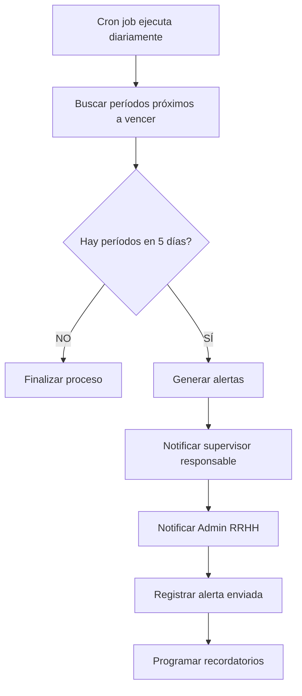

#### 🔄 FLUJO 4.3: EVALUACIÓN Y CONFIRMACIÓN
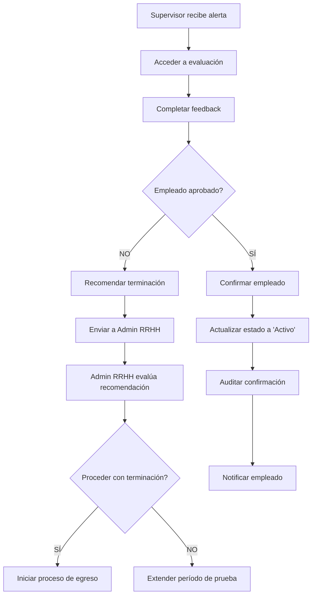

### Estados de Período de Prueba
- **Activo**: Período en curso
- **Próximo a Vencer**: 5 días o menos para finalizar
- **Vencido**: Período terminado sin evaluación
- **Aprobado**: Empleado confirmado exitosamente
- **Rechazado**: Empleado no confirmado
- **Extendido**: Período prolongado por decisión administrativa

---

## 🚪 MÓDULO 5: GESTIÓN DE EGRESOS

### Propósito
Administrar el proceso completo de salida de empleados con workflow de aprobaciones, validaciones automáticas y cierre de expedientes.

### Componentes Principales
1. **Solicitud de Egreso**
2. **Workflow de Aprobaciones**
3. **Validaciones Automáticas**
4. **Cierre de Expediente**
5. **Reportes de Egresos**

### Flujo de Procesos

#### 🔄 FLUJO 5.1: SOLICITUD DE EGRESO
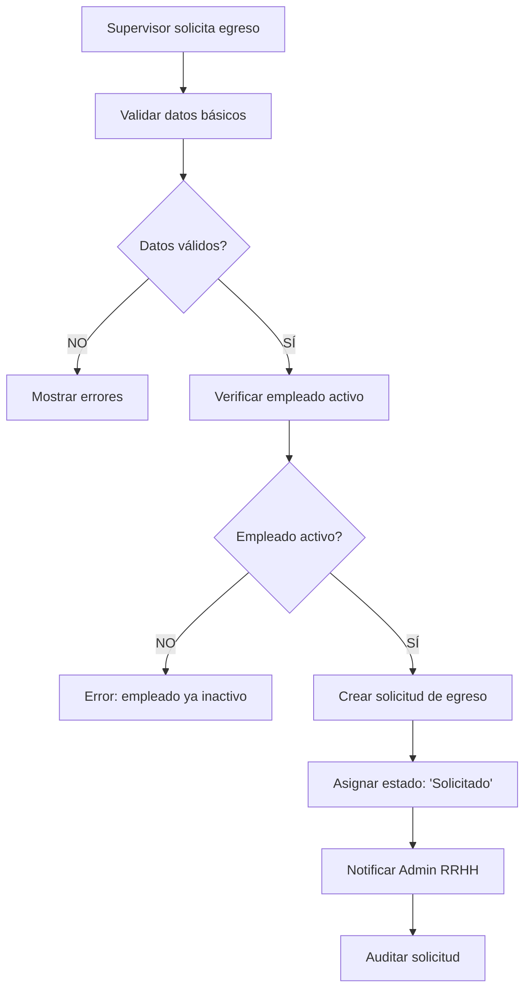

#### 🔄 FLUJO 5.2: PROCESO DE APROBACIÓN
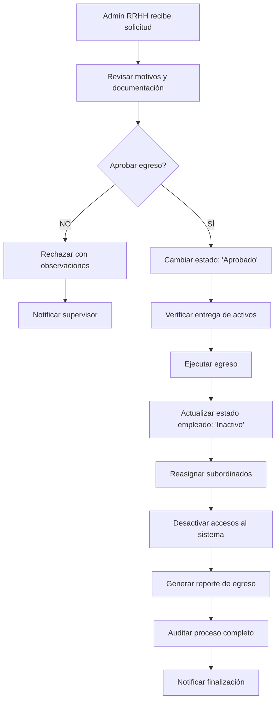

#### 🔄 FLUJO 5.3: VALIDACIONES AUTOMÁTICAS
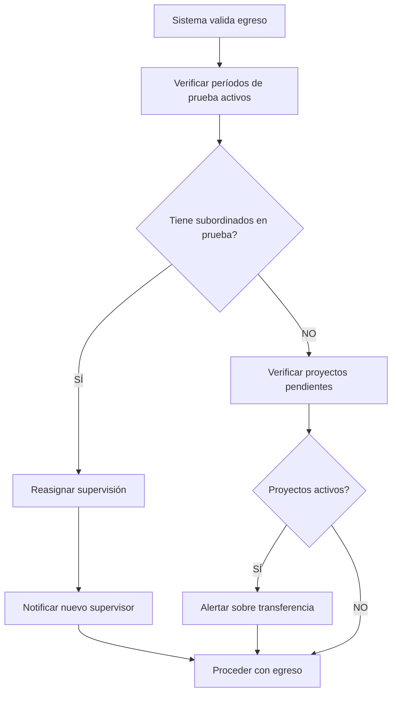

### Estados de Egreso
- **Solicitado**: Solicitud inicial pendiente de revisión
- **En Revisión**: Admin RRHH evaluando la solicitud
- **Aprobado**: Egreso autorizado, pendiente de ejecución
- **Rechazado**: Solicitud denegada con observaciones
- **Procesado**: Egreso completado exitosamente
- **Cancelado**: Proceso cancelado por solicitud

---

## 📊 MÓDULO 6: DASHBOARD Y REPORTES

### Propósito
Proporcionar visualización de datos en tiempo real, indicadores clave de gestión y reportes personalizados según el rol del usuario.

### Componentes Principales
1. **Dashboard Personalizable**
2. **Indicadores en Tiempo Real**
3. **Sistema de Alertas**
4. **Generador de Reportes**
5. **Exportación de Datos**

### Flujo de Procesos

#### 🔄 FLUJO 6.1: CARGA DE DASHBOARD
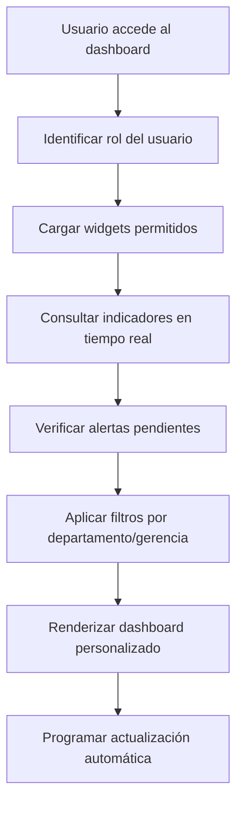

#### 🔄 FLUJO 6.2: GENERACIÓN DE REPORTES
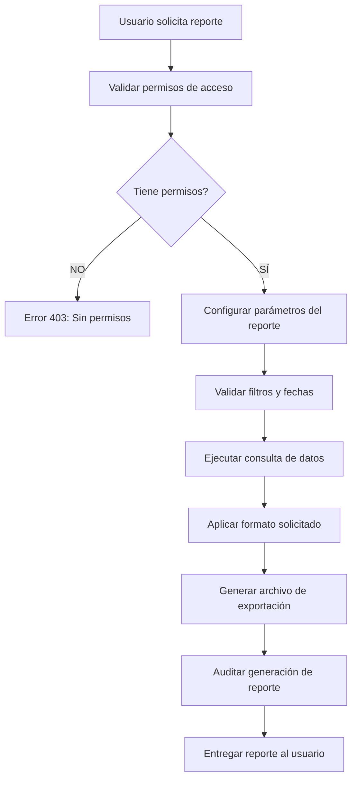

#### 🔄 FLUJO 6.3: SISTEMA DE ALERTAS
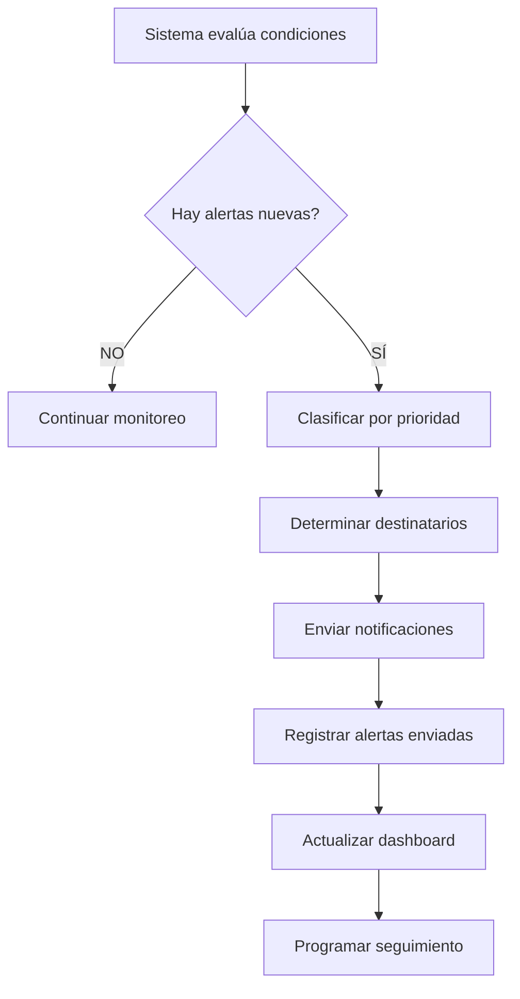

### Widgets por Rol

#### **Gerente RRHH**
- Indicadores ejecutivos generales
- Distribución de empleados por gerencia
- Contratos próximos a vencer (toda la empresa)
- Rotación de personal y tendencias
- Presupuesto de nómina vs. real
- Alertas críticas del sistema

#### **Admin RRHH**
- Empleados en período de prueba
- Solicitudes de egreso pendientes
- Movimientos internos en proceso
- Candidatos en reclutamiento
- Alertas de renovación de contratos
- Reportes de auditoría

#### **Supervisor**
- Equipo directo y estados
- Períodos de prueba de subordinados
- Solicitudes pendientes de aprobación
- Indicadores de productividad del equipo
- Alertas de feedback requerido

#### **Admin IT**
- Usuarios activos y sesiones
- Logs de acceso y errores
- Asignaciones de roles pendientes
- Métricas de sistema
- Reportes de seguridad

### Tipos de Reportes Disponibles
- **Nómina de Empleados**: Lista completa con filtros
- **Movimientos por Período**: Ascensos, traslados, ingresos
- **Egresos Detallados**: Motivos y análisis de rotación
- **Períodos de Prueba**: Estados y resultados
- **Auditoría de Cambios**: Trazabilidad completa
- **Indicadores de Gestión**: KPIs ejecutivos

---

## 🔄 FLUJOS TRANSVERSALES DEL SISTEMA

### FLUJO MAESTRO: CICLO DE VIDA DEL EMPLEADO
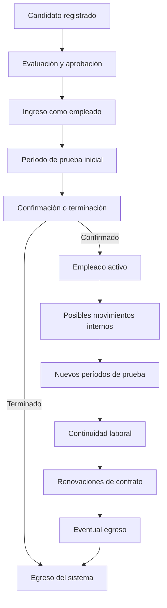

### FLUJO DE VALIDACIONES AUTOMÁTICAS
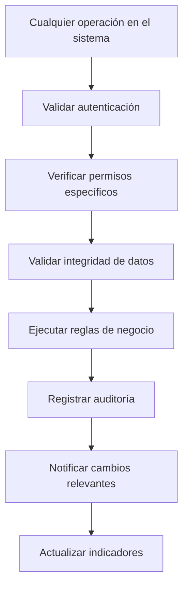

### FLUJO DE NOTIFICACIONES
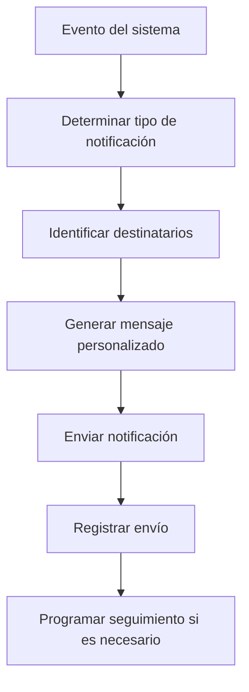

---

## 🎯 INTEGRACIÓN ENTRE MÓDULOS

### Dependencias Principales
- **Autenticación** → Base para todos los módulos
- **Empleados** → Requerido por Contratos, Períodos de Prueba, Egresos
- **Contratos** → Genera Períodos de Prueba automáticamente
- **Períodos de Prueba** → Puede generar Egresos si no se aprueba
- **Egresos** → Afecta estados en Empleados y reasigna subordinados
- **Dashboard** → Consume datos de todos los módulos

### Eventos de Sistema que Disparan Flujos
1. **Nuevo empleado** → Crea período de prueba automático
2. **Movimiento interno** → Puede crear período de prueba
3. **Período de prueba próximo a vencer** → Genera alertas
4. **Contrato próximo a vencer** → Genera alerta de renovación
5. **Egreso de supervisor** → Reasigna subordinados automáticamente
6. **Cambio de rol** → Actualiza permisos y accesos

Esta definición completa asegura que cada módulo esté perfectamente integrado con flujos de procesos claros, validaciones automáticas y trazabilidad completa de todas las operaciones del sistema.